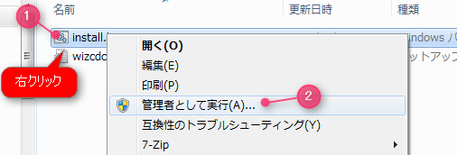
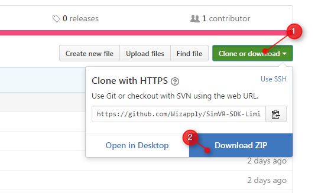

SimVR-Tools
==================
SIMVRとは、VR(ヴァーチャルリアリティ)HMDに特化した多軸モーションシミュレータシステムです。ピッチ・ヨー・ロールの3軸回転にヒーブの上下揺れを加えた動きが可能で、様々なアタッチメント用いて、多岐にわたるVRシミュレータ用途に対応します。ここでは、SIMVR用のアプリケーションを開発するためのツール・プログラムがあります。  

ライセンスされたSIMVR用で、SIMVRが同時稼働1台につき1ライセンス必要です。追加ライセンス希望の方は[お問い合わせ先](#お問い合わせ先)までご連絡くださいますようお願い致します。 

また、プログラムに不具合がございまいたらご報告いただければ幸いです。

* SIMVR製品ページ ： http://simvr01.com

## フォルダ構成
* `/build_c++` : C++(VisualStudio 2015, CMAKE)で開発可能なInclude、DLLファイル群
* `/build_unity5` : Unity5で開発可能なUnityPackageファイル
* `/build_ue4` : 最新UnrealEngine4で開発可能なプラグイン及びプロジェクト群
* `/build_ue4_12` : UnrealEngine4.12で開発可能なプラグイン及びプロジェクト群
* `/demo` : SIMVRの動作を確認するためのサンプルデモゲーム群
* `/driver` : SIMVR USB-CDCドライバ
* `/resources` : GitHub用リソースファイル（開発には必要ありません）

## 必須動作環境
* オペレーティングシステム : Windows 7以降、Linux 4.4.0以降
* インターフェース : USB2.0ポート1つ以上
* ソフトウェア : VS2015 Visual C++ 再頒布可能パッケージ([ダウンロード](https://www.microsoft.com/ja-jp/download/details.aspx?id=48145))

※ SIMVRを動作させるためだけの環境であり、開発するVRなどのコンテンツ規模に合う**高性能パソコン**をご用意ください。Windows 10以降の場合、ドライバのインストールは必要ありません。

## 使い方
### 機材の取扱いについてのご説明は[**説明書**](https://github.com/Wizapply/SIMVR-Tools/blob/master/SIMVR_Manual.pdf)をご確認ください。  

Windows 10未満をご利用の場合は、`/driver/wizcdc.inf`ファイルをインストールしてからSIMVRをパソコンに接続してください。  
    

デジタル署名情報が含まれていませんと表示された場合は以下を試してみてください。  
[デジタル署名のないドライバをインストールする方法](http://www.personal-media.co.jp/utronkb/support/install_sig_win8.html)  

### データダウンロード方法
GitHub右上ボタンよりダウンロード可能  
  

### 実行・セットアップ
実際の使い方・セットアップについては、[**SimVR-SDK Wiki**](https://github.com/Wizapply/SIMVR-Tools/wiki "SimVR-Tools Wiki")にまとめておりますので、そちらをご覧ください。  

## 開発向けライセンスについて
これらのファイルによって開発されたアプリケーションを実機で稼働させるためにライセンス認証が必要です。  
ご購入いただいたお持ちのSIMVRでのみご利用が認められておりますので、別のSIMVRによるビジネスや展示会等でご利用の際は追加でライセンスしてください。  

開発しているアプリケーションを認証するには[**SIMVRキーのオンライン発行**](http://simvr01.com/simvrkeygen/)でキーを取得してください。  

## お問い合わせ先
これらGitHubにアップロードされている全てのファイルについてご質問・ご報告は、下記ご連絡先までご確認ください。

  
株式会社しのびや.com Wizapply事業部  
大阪府大阪市港区市岡元町３－７－１０　KSビル５F  
E-Mail : info@wizapply.com  
TEL : 06-4400-6308  
Web : <http://wizapply.com>  
